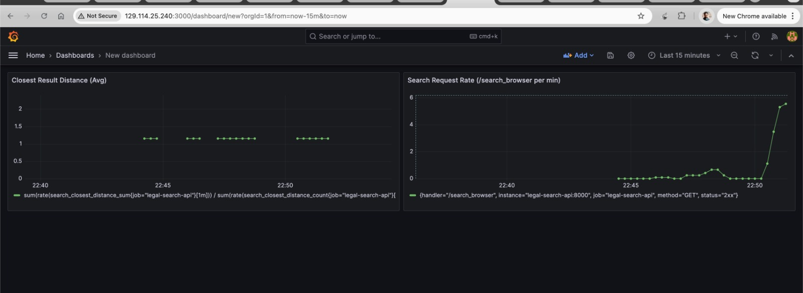

## LegalAI: NLP-based Case Law Identification and Summarization Assistant

Our machine learning system integrates directly into existing legal research and case preparation workflows. Currently, lawyers and paralegals manually review extensive legal documents, case transcripts, and previous rulings to identify relevant precedents, arguments, and key details. This manual review process is labor-intensive and time-consuming. 

Our proposed AI assistant, LegalAI, will function as a digital paralegal, enabling legal professionals to upload details and transcripts of their current cases. Leveraging advanced NLP techniques and large language models, the system automatically identifies, and extracts essential information from relevant case laws. The tool will generate concise summaries and provides essential metadata, allowing lawyers and paralegals to rapidly review pertinent case details with direct links to access comprehensive documents online.

This approach not only streamlines and accelerates legal research but significantly enhances objectivity and accuracy in identifying relevant precedents, allowing legal teams to handle a greater volume of cases effectively and strategically.


### Non-ML Status Quo:

#### Currently, lawyers and paralegals manually review extensive legal documents and case transcripts, which is:
* Time-consuming: Reviewing extensive legal documents, transcripts, and prior rulings demands substantial time, limiting productivity.
* Prone to human error: Critical precedents, arguments, or subtle legal nuances can easily be overlooked due to fatigue or oversight.
* Inefficient: Manual searching through vast legal resources is inefficient, particularly when rapid response and thorough analysis are required.
* Difficult to scale: As the volume of cases grows, manually managing comprehensive reviews becomes unsustainable, restricting the volume of cases a legal professional can effectively handle.

### Business Metrics:

#### The success of the LegalAI system will be evaluated using the following business metrics:
* Reduction in Time Spent Reviewing Case Documents: Currently, legal professionals typically spend several hours per case manually reviewing relevant documents and case laws. With LegalAI, automated summarization and extraction reduce review time significantly—potentially from hours down to minutes—freeing up valuable time for strategic preparation.
* Improved Identification Accuracy: The system’s capability to pinpoint relevant precedents, critical arguments, and essential metadata should consistently surpass manual review accuracy.
* User Satisfaction and Usability: Feedback from lawyers and paralegals regarding system intuitiveness, reliability, and practical utility will serve as a critical measure of success.
* Enhanced Case Outcomes: Indirectly, the system’s impact on improved case preparation and positive legal outcomes will serve as a core indicator of its effectiveness.

### Value Proposition

#### Who is the customer?
The primary customers for the LegalAI system are lawyers, paralegals, and legal research professionals working in law firms, in-house legal departments, judicial systems, and legal consulting services. For instance, law firms handling complex litigation cases with extensive documentation, such as corporate legal teams and legal research firms (e.g., LexisNexis, Westlaw), would significantly benefit from the efficiency and precision offered by the system.

#### Where will it be used?

The LegalAI assistant will be deployed in law firms, corporate legal departments, court systems, and academic institutions that engage heavily in legal research. The system can also be integrated with online legal research databases and platforms such as LexisNexis, Westlaw, or public judiciary databases, enhancing their existing search and summarization capabilities.


#### Benefits of our system over the current system:
* Time Savings: Automates the manual and labor-intensive task of reviewing legal documents, allowing legal professionals to dedicate more time to strategic case preparation.
* Improved Accuracy: Detects critical legal precedents and arguments that might otherwise be overlooked, ensuring more thorough and precise legal analyses.
* Scalability: Allows law firms and legal professionals to efficiently handle a larger number of cases by significantly reducing time and effort spent on administrative and review tasks.
* Objective Insights: Delivers consistent, unbiased summaries and metadata extraction, reducing variability inherent in manual analysis.
* Confidence Scores: Recommendation or summarized precedent is accompanied by a confidence score if its below certain threshold (e.g., "This precedent matches your case context with 72% confidence"), supporting informed decision-making.


### Contributors

<!-- Table of contributors and their roles. 
First row: define responsibilities that are shared by the team. 
Then, each row after that is: name of contributor, their role, and in the third column, 
you will link to their contributions. If your project involves multiple repos, you will 
link to their contributions in all repos here. -->

| Name                            | Responsible for| Link to their commits in this repo |
|---------------------------------|-----------------|------------------------------------|
| All team members                |Idea formulation, value proposition, ML problem setup, integration|     NA                               |
| Arnab Bhowal                   |Model Training|        https://github.com/Sanjeevan1998/ml-ops-project/commits/main/?author=arnabbhowal                            |
| Sanjeevan Adhikari                   |Model Serving and Monitoring|             https://github.com/Sanjeevan1998/ml-ops-project/commits/main/?author=Sanjeevan1998                       |
| Divya Chougule                   |Data Pipeline (Unit 8)|                 https://github.com/Sanjeevan1998/ml-ops-project/commits/main/?author=divyaa25                   |
| Vishwas Karale                   |Continous X Pipeline|                   https://github.com/Sanjeevan1998/ml-ops-project/commits/main/?author=vishwaskarale83                 |


### System diagram


### Summary of outside materials

<!-- In a table, a row for each dataset, foundation model. 
Name of data/model, conditions under which it was created (ideally with links/references), 
conditions under which it may be used. -->

# Legal Case Analysis Datasets and Foundation Models

## Datasets for Legal Case Analysis 

| Name | How it was created | Conditions of use |  
|------------------------------------|--------------------|-------------------|  
| [**Lexis Nexis Dataset**](https://www.lexisnexis.com/) | LexisNexis offers extensive legal databases with case law, statutes, regulations, and other legal documents. They also provide access to news articles and other legal resources |  

## Foundation Models

| Name      | How it was created | Conditions of use |
|----------|--------------------|-------------------|
| [**Legal-BERT**](https://huggingface.co/nlpaueb/legal-bert-base-uncased?utm_source=chatgpt.com)     | Fine-tuned on legal corpora (e.g., contracts, court decisions) for legal language understanding and metadata tagging. | Available for academic research; non-commercial use advised |

<!-- Itemize all your anticipated requirements: What (`m1.medium` VM, `gpu_mi100`), 
how much/when, justification. Include compute, floating IPs, persistent storage. 
The table below shows an example, it is not a recommendation. -->


## Deployment and Execution

The Product is a Cloud Native application which can be bootstapped in multiple phases. The Development & Operations Lifecycle of the Product is distributed as follows. The Project can be launched on Trovi as [Legal AI - NLP CaseLaw Identifier](https://chameleoncloud.org/experiment/share/a49b98c4-fb07-41f0-a045-dd68735b7dc3)

- **Boostrapping Phase** : In this Phase we will be setting up the initial Infrastructure which is defined as IaaC using Terraform Scripts and Ansible Playbooks
- **Development Phase** : In this Phase we train the initial Model and also we evaluate our base performance we use GPU Machines and train Models using Ray Clusters.
- **Runtime Phase** : In Runtime we Monitor the Performance of our Model where we Check for the Performance of the Model also monitor the model for Data drift
- **Update Phase** : Once in the Runtime Phase if we observe issues or have bugs with our model or need to add new features we start back in the retraining phase where we make modifications to the existing model and then take the model till Production following a Staged Deployment
- **End Phase** : In End Phase we shut down all our systems gracefully ensuring all consumed Chameleon Cloud Resources are released


### Development and Operations Flow

| Stage | Notebook Pipelines | Operations Executed |
|-------|--------------------|---------------------|
| Bootstrapping | [0_create_persistent_storage.ipnyb](https://github.com/Sanjeevan1998/ml-ops-project/blob/main/notebooks/bootstrap/0_create_persistent_storage.ipynb) | This Notebook will initially clone this Repo from Github which contains all the Code help in Setting up the Persistent Storage Block on CHI@UC which is used throughout using terraform |
| Bootstrapping | [1_key_setup.ipynb](https://github.com/Sanjeevan1998/ml-ops-project/blob/main/notebooks/bootstrap/1_key_setup.ipynb) | This will Setup the initial Key Pair with KVM@TACC, it is separated as it runs with Python Kernal and other run with Bash |
| Bootstrapping | [2_k8s_setup.ipynb](https://github.com/Sanjeevan1998/ml-ops-project/blob/main/notebooks/bootstrap/2_k8s_setup.ipynb) | This will create the intial Infrastructure on KVM@TACC which includes Compute Node, Floating IP, Attached Storage. After Node creation this notebook will further Setup K8S using Ansible and KubeSpray and all required tools (MinIO, MLFlow, Postgres, Grafana, Prometheus, ArgoCD, ArgoWorkflows) all are running on single K8S |
| Development | [1_create_server.ipynb](https://github.com/Sanjeevan1998/ml-ops-project/blob/main/data-pipeline/1_create_server.ipynb) [2_object.ipynb](https://github.com/Sanjeevan1998/ml-ops-project/blob/main/data-pipeline/2_object.ipynb)| This will Create persistent storage and Use rclone and authenticate to object store from a compute instance |
| Development | [docker-compose-etl.yaml](https://github.com/Sanjeevan1998/ml-ops-project/blob/main/data-pipeline/docker/docker-compose-etl.yaml) | ETL - This will downloads the raw PDFs to the persistent storage, extracts text and metadata from PDFs and generates structured CSV files.Then loads processed data to object storage for downstream tasks. | 
| Development | [1_create_initial_deployment.ipynb](https://github.com/Sanjeevan1998/ml-ops-project/blob/main/notebooks/development/1_create_initial_deployment.ipynb) | This will create the Argo Workflows needed for building, training, promoting model as well as will setup the Helm Charts for different Environments |
| Development | [1_Model_training_setup.ipynb](https://github.com/Sanjeevan1998/ml-ops-project/tree/main/notebooks/development/model_training/1_Model_training_setup.ipynb) |  Provisions a Chameleon Cloud GPU node and installs essential system software like Docker and NVIDIA drivers. |
| Development | [2_Model_training_run.ipynb](https://github.com/Sanjeevan1998/ml-ops-project/tree/main/notebooks/development/model_training/2_Model_training_run.ipynb) |  Guides through running the training script in a standalone Docker container, setting up a local MLflow instance for experiment tracking, and connecting to remote services. |
| Development | [3_Model_training_ray.ipynb](https://github.com/Sanjeevan1998/ml-ops-project/tree/main/notebooks/development/model_training/3_Model_training_ray.ipynb) | Details setting up a Ray cluster on the provisioned node using Docker Compose and submitting the training script as a Ray job, configured to use a remote MLflow server (KVM@TACC) for experiment tracking. |
| Runtime | [dummy_serving](https://github.com/Sanjeevan1998/ml-ops-project/tree/main/notebooks/) | Model Serving & Monitoring |
| Update | [3_Model_training_ray.ipynb](https://github.com/Sanjeevan1998/ml-ops-project/tree/main/notebooks/development/model_training/3_Model_training_ray.ipynb) | Used for model re-trainnig when the performance of the model drops using the user feedback data from production  |
| End | [0_delete_persistent_storage.ipynb](https://github.com/Sanjeevan1998/ml-ops-project/blob/main/notebooks/delete/0_delete_persistent_storage.ipynb) | This will delete the Persistent Storage on CHI@UC |
| End | [1_delete_kvm_deployment.ipynb](https://github.com/Sanjeevan1998/ml-ops-project/blob/main/notebooks/delete/1_delete_kvm_resources.ipynb) | This will delete all the resources from KVM@TACC |


## Summary of infrastructure requirements

### Resource Requirements  

| Requirement         | Quantity/Duration         | Justification  |
|---------------------|-------------------------|---------------|
| **m1.xlarge VMs**  | 1 for entire project duration | These general-purpose VMs will host Kubernetes clusters, run data pipelines (Kafka, Airflow), serve APIs (FastAPI), and manage CI/CD pipelines (ArgoWorkflow, ArgoCD). They provide sufficient CPU and memory resources for these workloads without unnecessary cost. |
| **Any available GPU** | 2 GPUs (V100 or equivalent), 8-hour blocks, twice weekly | Required for fine-tuning Legal-BERT on large case law data. Also needed for distributed training via Ray. |
| **Persistent Storage** | 20GB for entire project duration, we will scale down after monitoring the disk usage | Persistent storage is necessary to securely store raw and processed datasets, trained model artifacts, container images, and experiment tracking data (MLFlow). This ensures data persistence, reproducibility, and easy access across different stages of the pipeline. |
| **Floating IPs** | 2 for entire project duration | One floating IP is required for public access to the model-serving API endpoints and monitoring dashboard. The second floating IP is needed for accessing internal services such as MLFlow experiment tracking and monitoring dashboards (Prometheus/Grafana). |

## Data pipeline

#### 1. Persistent Storage
- Storage Type: Persistent block storage (Swift volume) mounted on the Chameleon node.
- Volume Name: lexisraw
- Mount Path: /mnt/persistent/lexisraw
- [Persistent storage](https://github.com/Sanjeevan1998/ml-ops-project/blob/main/data-pipeline/persistent.png)

#### 2. Offline Data
- Dataset: Case law files from LexisNexis.
- Total Files: ~30,000 case law PDFs.
- Sample Example: [sample](https://github.com/Sanjeevan1998/ml-ops-project/blob/main/images/SampleCaseLaw.png)

Ground Truth: The metadata extracted (case name, court, date) serves as the ground truth for training and evaluation.

#### 3. Data Pipeline
   Create persistent storage and Use rclone and authenticate to object store from a compute instance
   - [1_create_server.ipynb](https://github.com/Sanjeevan1998/ml-ops-project/data-pipeline/1_create_server.ipynb)
   - [2_object.ipynb](https://github.com/Sanjeevan1998/ml-ops-project/data-pipeline/2_object.ipynb)

   #### ETL
  - Extract - unzips data from the direct download link
  - Transform - Extracts metadata from raw case law files
  - Load - loads the data in object storage
    [docker-compose-etl.yaml](https://github.com/Sanjeevan1998/ml-ops-project/blob/main/data-pipeline/docker/docker-compose-etl.yaml)


### Model Training
#### Unit 4 (Model training at scale):
- Trained/fine-tuned the legal-bert model using triplet data to train and retrain it on the production:
    We fine-tune a pre-trained Legal-BERT model utilizing a specialized dataset composed of legal text triplets (anchor, positive, negative samples) to enhance its understanding of semantic similarity. This fine-tuning process is designed to be repeatable, allowing the model to be initially trained and subsequently retrained with new user feedback data from production to continuously improve its relevance and accuracy in retrieving similar case files.
- Legal-BERT was chosen as our base model because it has been specifically pre-trained on a vast corpus of legal texts, endowing it with a strong understanding of legal terminology, context, and nuances. This domain-specific pre-training makes it significantly more effective and data-efficient to fine-tune for specialized legal NLP tasks, such as semantic similarity for case law, compared to generic language models. Its architecture is well-suited for capturing the complex relationships within legal documents.

#### Unit 5 (Model training infrastructure and platform):
- We deployed a centralized MLflow tracking server (backed by PostgreSQL and MinIO) on a KVM@TACC instance, and our Python training scripts are instrumented with MLflow API calls to log all relevant parameters, metrics, and model artifacts to this remote server.
- We meet this by deploying a Ray cluster (head and worker nodes) on a CHI@UC GPU node using Docker Compose, and our model training script is submitted as a job to this cluster via the ray job submit CLI for managed execution.
- The Ray cluster setup provides the foundation to integrate Ray Tune for future automated hyperparameter optimization, enabling efficient exploration of model configurations.
- Our fine-tuning strategy for Legal-BERT uses a technique called "triplet loss." The model is shown three pieces of legal text at a time: an "anchor" text, a "positive" text (that is similar to the anchor), and a "negative" text (that is different from the anchor). The model learns to make its internal understanding (embeddings) of the anchor and positive texts very close, while pushing the understanding of the anchor and negative texts further apart, thereby improving its ability to identify semantically similar legal documents.


### Model Serving (Unit 6) and Monitoring (Unit 7) for LegalAI
(Disclaimer: The work for model serving (Unit 6) and monitoring (Unit 7) was developed step-by-step inside the code/serving_dummy/ directory in this repository. We started with basic FastAPI, Prometheus, and Grafana containers. Through many small steps, we got to the point where our model serving API is working and we can monitor its performance. The instructions below explain how to get this part of our project running and see its features.)
<!-- Make sure to clarify how you will satisfy the Unit 4 and Unit 5 requirements, 
and which optional "difficulty" points you are attempting. -->

**I. Setting Up the Environment on Chameleon Cloud**

To run and test our model serving and monitoring setup, you'll first need a virtual machine (VM) on Chameleon Cloud.

1.  **Create a VM:**
    * You can create a CPU node (like an `m1.large`) on **KVM@TACC** or a GPU node (like a `gpu_rtx6000`) on **CHI@UC**.
    * We've provided the Jupyter Notebook that shows how we created a CPU node at KVM@TACC using `python-chi`. You can find a PDF version of this notebook here: [`reports/model-serving/runvm.ipynb`](./reports/model-serving/runvm.ipynb).
        * This notebook covers creating the VM, getting a floating IP, and setting up security groups for necessary ports: 22 (SSH), 8000 (our FastAPI app), 3000 (Grafana), and 9090 (Prometheus).

2.  **SSH into the VM:**
    * Once your VM is running and has a floating IP address, connect to it using SSH:
        ```bash
        ssh -i /path/to/your/chameleon_private_key cc@<VM_FLOATING_IP>
        ```

3.  **Initial VM Setup:**
    * Make sure `python3` and `pip3` are installed. Ubuntu 22.04 usually has these. If not, you can install them with:
        ```bash
        sudo apt update
        sudo apt install python3 python3-pip -y
        ```
    * **For GPU VMs Only:** If you're using a GPU VM for serving:
        * You'll need to install NVIDIA drivers. Make sure they are compatible with CUDA 12.1 (which our Docker image uses). We followed steps similar to those shown in class (using `ubuntu-drivers devices` then `sudo apt install nvidia-driver-XXX`).
        * Install the NVIDIA Container Toolkit. You can follow the official NVIDIA guide for this. This allows Docker to use the GPU.
        * After installing drivers or the toolkit, restart Docker: `sudo systemctl restart docker`.

4.  **Mount Persistent Object Storage (using rclone):**
    Our application needs to access our team's fine-tuned model, the FAISS index, and metadata files. These are stored in our team's persistent object storage. Here's how to mount it:
    * Install rclone:
        ```bash
        curl [https://rclone.org/install.sh](https://rclone.org/install.sh) | sudo bash
        ```
    * Allow FUSE for non-root users (this might already be set):
        ```bash
        sudo sed -i '/^#user_allow_other/s/^#//' /etc/fuse.conf
        ```
    * Create the rclone configuration directory and file:
        ```bash
        mkdir -p ~/.config/rclone
        nano ~/.config/rclone/rclone.conf
        ```
    * Paste the following configuration into `rclone.conf`. **Important: Replace the placeholders (`<...>`) with your team's actual Chameleon application credential ID and secret.**
        ```ini
        [chi_uc_object_store]
        type = swift
        user_id = <chameleon_user_id_with_access_to_team_storage>
        application_credential_id = <your_team_application_credential_id>
        application_credential_secret = <your_team_application_credential_secret>
        auth = [https://chi.uc.chameleoncloud.org:5000/v3](https://chi.uc.chameleoncloud.org:5000/v3)
        region = CHI@UC
        ```
        *(Note: Adjust the `region` if your team's object storage bucket was created at a different Chameleon site.)*
    * Create the mount point on your VM and set permissions:
        ```bash
        sudo mkdir -p /mnt/object-store-persist-group36
        sudo chown -R cc:cc /mnt/object-store-persist-group36
        ```
    * Mount the object storage. **It's best to run this command in a separate terminal window or a `screen`/`tmux` session on the VM because it will run in the foreground and show live connection logs.**
        ```bash
        rclone mount chi_uc_object_store:object-store-persist-group36 /mnt/object-store-persist-group36 --read-only --allow-other --vfs-cache-mode full -vv
        ```
        This command makes our team's persistent storage available at `/mnt/object-store-persist-group36` on the VM in read-only mode. Our Docker containers will then mount this path.

5.  **Clone the Project Repository:**
    In a new terminal window (or another `screen`/`tmux` window if rclone is running in your current one):
    ```bash
    git clone [https://github.com/Sanjeevan1998/ml-ops-project.git](https://github.com/Sanjeevan1998/ml-ops-project.git)
    cd ml-ops-project/code/serving_dummy
    ```
    The `serving_dummy` directory is the main working area for this part of the project.

6.  **Prepare the ONNX Model (Quantization):**
    * We found that an INT8 quantized ONNX model gives good performance. This model is created from our team's fine-tuned Legal-BERT.
    * The script [`src/processing/quantize_onnx_model.py`](./src/processing/quantize_onnx_model.py) handles exporting the PyTorch model to ONNX and then quantizing it.
    * This script expects the original fine-tuned PyTorch model to be at `/mnt/object-store-persist-group36/model/Legal-BERT-finetuned` (which is available through the rclone mount). It saves the optimized ONNX models to `/tmp/optimized_models/` on the VM.
    * To create the quantized model, run this from the `serving_dummy` directory:
        ```bash
        python3 src/processing/quantize_onnx_model.py
        ```
    * The quantized model will then be ready at `/tmp/optimized_models/legal_bert_finetuned_onnx_int8_quantized/`. Our Docker setup will mount this path into the container.

7.  **Configure Docker Compose for Your VM (CPU or GPU):**
    * Our project uses a single [`Dockerfile`](./Dockerfile) that can build an image for both CPU and GPU.
    * The specific configuration for CPU or GPU deployment is managed in the [`docker-compose.yaml`](./docker-compose.yaml) file.
    * We've provided example configurations for both CPU and GPU setups in the file [`info.txt`](./info.txt) *(Self-note: Make sure this file exists and is accurate, or embed the compose configurations here in the README using Markdown code blocks)*.
    * **Action Required:** Look at [`info.txt`](./info.txt).
        * If your VM is **CPU-only**, copy the CPU `docker-compose.yaml` content from `info.txt` and replace the current content of `docker-compose.yaml`.
        * If your VM is **GPU-equipped** (and you've set up NVIDIA drivers and toolkit), copy the GPU `docker-compose.yaml` content from `info.txt` into `docker-compose.yaml`.
    * Also, the `MODEL_DEVICE_PREFERENCE` environment variable (either in the Dockerfile or overridden in `docker-compose.yaml`) should be set to `"cpu"` (or `"auto"`) for CPU VMs, and `"cuda"` for GPU VMs.

8.  **Build and Run Docker Containers:**
    * Once `docker-compose.yaml` is correctly set up for your VM type (CPU or GPU), run the following command from the `serving_dummy` directory:
        ```bash
        docker compose up -d --build
        ```
    * This will build the Docker image (which can take ~2-5 minutes on a CPU node, or ~10-15 minutes on a GPU node if downloading base images for the first time and installing many dependencies) and then start the API service, Prometheus, and Grafana.
    * To check if the API started correctly and to see which device it's using (CPU or CUDA), you can view its logs:
        ```bash
        docker logs legal-search-api-dummy
        ```
        Look for lines in the log indicating "Effective device: cpu" or "Effective device: cuda".
    * **If everything started successfully, you can access the services at:**
        * **LegalAI Search API (Frontend):** `http://<VM_FLOATING_IP>:8000/`
        * **FastAPI Health Check:** `http://<VM_FLOATING_IP>:8000/health`
        * **Prometheus:** `http://<VM_FLOATING_IP>:9090/`
        * **Grafana:** `http://<VM_FLOATING_IP>:3000/` (default login: admin/admin)
        *(Remember to replace `<VM_FLOATING_IP>` with the actual floating IP address of your Chameleon VM.)*

**II. Model Serving (Unit 6)**

This section details how our LegalAI system serves inference requests, addressing the "must satisfy" requirements for Unit 6 and an extra difficulty point. All related code for this part is primarily within the [`code/serving_dummy/`](./code/serving_dummy/) directory.

1.  **Serving from an API Endpoint:**
    * **How We Addressed It:** We built a web application using FastAPI that allows users to search for legal documents. Users can either type in a text query or upload a PDF document to find similar cases. The results are displayed on a web page.
    * **Key Code/Files:**
        * The main API logic with endpoints like `/search_combined` is in [`code/serving_dummy/src/api/main.py`](./code/serving_dummy/src/api/main.py).
        * The user interface for searching is [`code/serving_dummy/src/api/templates/index.html`](./code/serving_dummy/src/api/templates/index.html).
        * The page for displaying results is [`code/serving_dummy/src/api/templates/results.html`](./code/serving_dummy/src/api/templates/results.html).
    * **See It In Action:**
        * Screenshot of the search page: 

        * Screenshot of the results page: [`reports/model-serving/Results.png`]


2.  **Identify Requirements (Performance, etc.):**
    * **How We Addressed It:** We thought about what kind of performance LegalAI would need to be useful for legal professionals. This includes how fast it should respond (latency), how many searches it can handle at once (throughput/concurrency), and the size of our models. We used our load testing script to gather data to help define these.
    * **Key Code/Files for Testing:**
        * Load testing was done using the script: [`code/serving_dummy/src/test/load_test_api.py`](./code/serving_dummy/src/test/load_test_api.py).
        * Metrics can be collected in Prometheus, but currently we have logs in [`code/serving_dummy/src/api/main.py`](./code/serving_dummy/src/api/main.py).
    * **Detailed Requirements Document:** [`reports/model-serving/Identifyrequirements.pdf`](./reports/model-serving/Identifyrequirements.pdf)

3.  **Model Optimizations to Satisfy Requirements:**
    * **How We Addressed It:** To make our model run faster and take up less space, we converted our fine-tuned Legal-BERT model into the ONNX format. Then, we applied INT8 quantization to make it even smaller and quicker, especially on CPUs. Our API can load and serve this optimized ONNX model.
        * For example, our single file search (8 chunks) using the ONNX INT8 model on a CPU took about 3.59 seconds for embedding and core search logic.
    * **Key Code/Files:**
        * Script for converting to ONNX and quantizing: [`code/serving_dummy/src/processing/quantize_onnx_model.py`](./code/serving_dummy/src/processing/quantize_onnx_model.py) (this script also handles the initial export to ONNX).
        * I tried using basic Pytorch model, onnx and quantized onnx. 
    * **Detailed Model Optimizations Report:** [`reports/model-serving/Modeloptimizations.pdf`](./reports/model-serving/Modeloptimizations.pdf)

4.  **System Optimizations to Satisfy Requirements:**
    * **How We Addressed It:** We used FastAPI for our API because it's good at handling many user requests at the same time (asynchronous). We also used Docker to package our application, which makes it easy to deploy consistently. These choices help our system support multiple users and respond without long delays. This is discussed in more detail in our "Extra Difficulty Point" section below, where we compare CPU and GPU performance.
    * **Key Code/Files:**
        * FastAPI application: [`code/serving_dummy/src/api/main.py`](./code/serving_dummy/src/api/main.py).
        * Docker setup: [`code/serving_dummy/Dockerfile`](./code/serving_dummy/Dockerfile) and [`code/serving_dummy/docker-compose.yaml`](./code/serving_dummy/docker-compose.yaml).

5.  **Extra Difficulty Point: Develop Multiple Options for Serving (CPU vs. GPU Comparison)**
    * **How We Addressed It:** We set up and tested our LegalAI service on two different types of virtual machines on Chameleon Cloud: a standard CPU instance (`m1.large` at KVM@TACC) and a more powerful GPU instance (RTX 6000 at CHI@UC). We used our ONNX INT8 quantized model for these tests.
        * **CPU:** A single file search (8 chunks) took about **3.59 seconds**. Under a load of 5 concurrent users, it handled about **0.42 requests per second (RPS)** with an average latency of **12.46 seconds**, and 11% of requests failed. With 10 concurrent users, performance degraded further (0.48 RPS, 23.93s latency, 21% errors).
        * **GPU:** The same single file search took only about **1.56 seconds**. With 5 concurrent users, the GPU handled **1.12 RPS** with an average latency of **4.44 seconds** and no errors. At 10 concurrent users, it achieved **1.25 RPS** with 8.49s average latency and 10% errors.
        * The GPU was significantly faster for individual tasks (especially embeddings) and handled concurrent users much better with lower latency and fewer errors up to a certain point. However, GPU instances are generally more expensive.
    * **Key Code/Files:**
        * API with dynamic device (CPU/GPU) selection logic: [`code/serving_dummy/src/api/main.py`](./code/serving_dummy/src/api/main.py).
        * Docker Compose configurations (one for CPU, one for GPU, managed by editing [`docker-compose.yaml`](./code/serving_dummy/docker-compose.yaml) as described in setup, or see examples in `info.txt`).
        * The `python-chi` scripts for VM setup are referenced in [`reports/model-serving/how_to_run_vm_in_kvmtacc.pdf`](./reports/model-serving/how_to_run_vm_in_kvmtacc.pdf) (and would be adapted for GPU VM creation).
    * **Detailed Report on CPU vs. GPU:** [`reports/model-serving/ExtraDifficultyPoint.pdf`](./reports/model-serving/ExtraDifficultyPoint.pdf)


**III. Monitoring and Evaluation (Unit 7)**

This section explains our approach to evaluating and monitoring the LegalAI service, addressing the requirements for Unit 7. The core setup for monitoring is integrated with our services defined in [`code/serving_dummy/docker-compose.yaml`](./code/serving_dummy/docker-compose.yaml).

Our basic monitoring dashboard setup in Grafana, showing some initial metrics, can be seen here:

*(Caption: Early Grafana setup showing basic metrics. We exported a JSON for a more detailed dashboard, but integrating it fully is a next step due to time constraints.)*

Here’s how we addressed the specific Unit 7 requirements:

1.  **Offline Evaluation of Model:**
    * **Status:** Not fully Covered .
    * **In `serving_dummy`:** Our current setup focuses on serving an already-trained model. The full offline evaluation pipeline is a broader team effort, integrating with the model training parts (Units 4 & 5) and CI/CD (Unit 3). For this serving component, we rely on receiving a validated model.

2.  **Load Test in Staging:**
    * **Status:** Covered.
    * **How We Addressed It:** We developed an asynchronous load testing script, [`code/serving_dummy/src/test/load_test_api.py`](./code/serving_dummy/src/test/load_test_api.py). We used this script to send many concurrent requests to our API deployed on Chameleon (acting as our staging environment) to see how it performs under pressure. This was used for our CPU vs. GPU comparisons.
    * **Surfacing Results:** Currently, the load test script outputs detailed results (RPS, latency, error rates) to the console. For a more advanced setup, these metrics could be pushed to Prometheus or logged in a way that Grafana can display them.

3.  **Online Evaluation in Canary Environment:**
    * **Status:** Partially Covered (Foundation Laid / Planned).
    * **How We Addressed It:** Our load testing script ([`code/serving_dummy/src/test/load_test_api.py`](./code/serving_dummy/src/test/load_test_api.py)) can serve as the "artificial users" for online evaluation. We can configure it to send various types of queries/PDFs.
    * **Next Steps:** To do a full canary evaluation, we would deploy a new version of our model alongside the current one and direct a small percentage of these artificial user requests to it. We'd then compare performance and feedback before a full rollout. The current Docker setup can be adapted for this (e.g., by running two differently configured API services). A detailed plan for how the artificial users would represent the range of real user behaviors is an important next step.

4.  **Close the Loop (Feedback and Retraining Data):**
    * **Status:** Covered (Feedback Collection Implemented).
    * **How We Addressed It:** We've implemented a way for users to give feedback on search results.
        * The results page ([`code/serving_dummy/src/api/templates/results.html`](./code/serving_dummy/src/api/templates/results.html)) has "Correct 👍" / "Incorrect 👎" buttons.
        * This feedback is sent to the `/log_feedback` endpoint in our API ([`code/serving_dummy/src/api/main.py`](./code/serving_dummy/src/api/main.py)).
        * The API logs this feedback (query, result, feedback type, model used, device used) into a `feedback.jsonl` file located in the `/app/feedback_data/` directory inside the container (this directory is mounted from `feedback_data/` on the host VM as per [`docker-compose.yaml`](./code/serving_dummy/docker-compose.yaml)).
    * **Next Steps:** This collected feedback data, along with a portion of production queries and their results, would be saved and labeled to create new datasets for re-training our models, which is part of the broader MLOps cycle (Units 4, 5, 8).

5.  **Define a Business-Specific Evaluation:**
    * **Status:** Partially Covered (Metrics Defined, Plan to be Detailed).
    * **How We Addressed It:** In our initial project proposal for LegalAI, we defined key business metrics:
        * Reduction in time spent by legal professionals reviewing case documents.
        * Improved accuracy in identifying relevant precedents.
        * User satisfaction and usability.
    * **Next Steps/Current Implementation:** The user feedback mechanism (point 4 above) directly helps us start measuring "User Satisfaction and Usability." For a full deployment, we would need to design specific A/B tests or user studies to measure the reduction in review time and improvement in accuracy compared to the non-ML status quo. This detailed measurement plan would be part of our full project documentation.

**Monitoring Tools Setup:**
* **Prometheus:** Collects metrics from our API.(Not fully complete) Configured in [`code/serving_dummy/monitoring/prometheus.yaml`](./code/serving_dummy/monitoring/prometheus.yaml) and runs as a service in [`docker-compose.yaml`](./code/serving_dummy/docker-compose.yaml).
* **Custom Metrics:** Our FastAPI application ([`code/serving_dummy/src/api/main.py`](./code/serving_dummy/src/api/main.py)) exposes custom metrics like `query_embedding_duration_seconds`, `faiss_search_duration_seconds`, `feedback_received_total`, and `search_closest_distance`, which include labels for model type and device used.
* **Grafana:** Used for visualizing these metrics (in progress). It's deployed via [`docker-compose.yaml`](./code/serving_dummy/docker-compose.yaml) and can be accessed at `http://<VM_FLOATING_IP>:3000` (default login: admin/admin). We've started a basic dashboard and have an exported JSON for a more advanced one for future implementation.


**IV. Key Scripts and Their Roles**

This section briefly describes the purpose of important files and scripts used for the model serving and monitoring part of our LegalAI project. Most of these are located within the [`code/serving_dummy/`](./code/serving_dummy/) directory.

* **API and Serving Logic:**
    * [`code/serving_dummy/src/api/main.py`](./code/serving_dummy/src/api/main.py): This is the heart of our service. It's a FastAPI application that handles incoming search requests (text or PDF), uses our machine learning models (PyTorch or ONNX) to understand the query, searches our FAISS index for relevant legal documents, and sends back the results. It also exposes custom metrics for Prometheus.
    * [`code/serving_dummy/src/api/templates/index.html`](./code/serving_dummy/src/api/templates/index.html): The simple webpage where users can type their search or upload a PDF.
    * [`code/serving_dummy/src/api/templates/results.html`](./code/serving_dummy/src/api/templates/results.html): The webpage that displays the search results and allows users to give feedback.

* **Model Processing and Optimization Scripts (in [`code/serving_dummy/src/processing/`](./code/serving_dummy/src/processing/)):**
    * [`export_to_onnx.py`](./code/serving_dummy/src/processing/export_to_onnx.py): Takes our fine-tuned PyTorch model (Legal-BERT) and converts it into the ONNX format. This is the first step for optimizing the model.
    * [`quantize_onnx_model.py`](./code/serving_dummy/src/processing/quantize_onnx_model.py): Takes the ONNX model (created by `export_to_onnx.py` or as its first step) and applies INT8 quantization. This makes the model smaller and often faster, especially on CPUs. The output is the quantized ONNX model that our API uses for serving.
    * [`create_artifacts_from_object_storage.py`](./code/serving_dummy/src/processing/create_artifacts_from_object_storage.py): This script was used to process a larger set of PDF documents from our team's persistent object storage. It extracts text, chunks it, generates embeddings using our model, and builds the main FAISS index and metadata files that our API uses for searching.
    * [`create_real_artifacts.py`](./code/serving_dummy/src/processing/create_real_artifacts.py): A script for processing a smaller, local set of actual PDF documents (from the `real_pdfs` folder) to create a FAISS index, map, and placeholder metadata. Useful for local testing with real data.
    * [`create_dummy_artifacts.py`](./code/serving_dummy/src/processing/create_dummy_artifacts.py): Creates a very small, fake FAISS index and metadata using a few sample texts and a standard lightweight model. This was helpful for quick initial development and testing of the API structure without needing the full dataset or our custom model.

* **Testing and Evaluation:**
    * [`code/serving_dummy/src/test/load_test_api.py`](./code/serving_dummy/src/test/load_test_api.py): An asynchronous Python script we wrote to send many requests to our API at the same time. This helps us test how well the API performs under load (measuring speed, how many requests it can handle, and error rates).

* **Deployment and Orchestration:**
    * [`code/serving_dummy/Dockerfile`](./code/serving_dummy/Dockerfile): Contains the instructions to build the Docker image for our `legal-search-api` service. It sets up the Python environment, installs dependencies, and copies our application code. It's built on an NVIDIA CUDA base image so it can work for both CPU and GPU deployments.
    * [`code/serving_dummy/docker-compose.yaml`](./code/serving_dummy/docker-compose.yaml): This file tells Docker Compose how to run all our services together: our `legal-search-api`, Prometheus (for collecting metrics), and Grafana (for showing dashboards). It manages things like networking between containers, what data volumes to use, and environment variables for configuration (like choosing CPU or GPU). *(Note: Specific configurations for CPU vs. GPU deployment are provided in [`code/serving_dummy/info.txt`](./code/serving_dummy/info.txt) to be copied into this file as needed).*
    * [`code/serving_dummy/monitoring/prometheus.yaml`](./code/serving_dummy/monitoring/prometheus.yaml): The configuration file for Prometheus, telling it which services to get metrics from (like our API).

* **Infrastructure Setup Guide:**
    * [`reports/model-serving/how_to_run_vm_in_kvmtacc.pdf`](./reports/model-serving/how_to_run_vm_in_kvmtacc.pdf): A PDF version of our Jupyter Notebook that guides through programmatically setting up a CPU Virtual Machine on Chameleon Cloud at KVM@TACC using `python-chi`. This includes creating the VM, assigning a public IP, and configuring security groups. (This script can be adapted for GPU VM creation at CHI@UC).


#### Data pipeline

<!-- Make sure to clarify how you will satisfy the Unit 8 requirements,  and which 
optional "difficulty" points you are attempting. -->


We will implement two types of data pipelines to handle the ingestion, processing, and storage of data for our ML Assistant for Therapists:

**Offline ETL Pipeline (Batch Processing)**:
- Built using **Apache Airflow**, this pipeline will handle batch processing of raw datasets (e.g., Mental Health Reddit Dataset, GoEmotions).
- The pipeline will extract, clean, preprocess, and transform the data into a format suitable for training our models.
- Processed datasets will be stored in persistent storage (65-70GB) on **Chameleon Cloud** for use in model training and retraining.

**Online Streaming Pipeline (Real-Time Processing)**:
- Built using **Kafka** and **Zookeeper**, this pipeline will simulate real-time patient journal entries being ingested into the system. We might use Kafka (or a lightweight queue like Redis Streams, if complexity is too high) to simulate real-time entry streaming.
- The streaming data will be used for inference (model predictions) and monitoring (e.g., detecting data drift or anomalies).
- The pipeline will also store incoming data in persistent storage for further analysis and retraining.

### Relevant parts of the diagram:
- **Kubernetes Cluster → Data Pipelines**:
  - **Kafka/Zookeeper** (Online streaming pipeline)
  - **Apache Airflow** (Offline ETL pipeline)
- **Persistent Storage (200GB)**:
  - Stores raw and processed datasets, model artifacts, and inference data.

### Justification for our strategy:
- **Offline ETL Pipeline**: Batch processing is ideal for preparing large datasets for training and retraining. **Apache Airflow** is a widely-used workflow orchestration tool that allows us to define, schedule, and monitor ETL tasks efficiently. It ensures that our data is clean, consistent, and ready for use in model training.
- **Online Streaming Pipeline**: Real-time data ingestion is critical for simulating patient journal entries and testing our system's inference and monitoring capabilities. **Kafka** is a robust, scalable, and fault-tolerant platform for real-time data streaming, making it an excellent choice for this purpose.
- **Persistent Storage**: Ensures that all raw and processed data, as well as model artifacts, are securely stored and easily accessible for training, inference, and monitoring.

### Relation back to lecture material (Unit 8):
- **Persistent Storage**: We satisfy the requirement to provision persistent storage for datasets, models, and artifacts.
- **Offline Data Pipeline**: We satisfy the requirement to set up an ETL pipeline for batch processing of training data.
- **Online Data Pipeline**: We satisfy the requirement to simulate realistic online data streams for inference and monitoring.

### Specific numbers and details:
- **Persistent Storage**: 200GB on Chameleon Cloud.
- **Offline Pipeline**: Processes datasets (e.g., Mental Health Reddit Dataset, GoEmotions) with approximately 10,000-50,000 entries.
- **Online Pipeline**: Simulates real-time journal entries at a rate of ~100 entries per hour.

### Optional Difficulty Point Attempted:
- **Interactive Data Dashboard**: We will implement an interactive dashboard (using **Grafana**) to provide insights into data quality, such as missing values, outliers, and distribution changes over time. This dashboard will help us monitor and improve the quality of our training and inference data.


### Continuous X

<!-- Make sure to clarify how you will satisfy the Unit 3 requirements,  and which 
optional "difficulty" points you are attempting. -->

To ensure the smooth deployment procedure for updates, patch fixes for robustness, reliability, reproducibility, and scalability of our ML Assistant for Therapists, we will implement a robust Continuous X (CI/CD) pipeline using standard tools and practices.

**Infrastructure-as-Code**:
- We will use **Terraform** to define and provision our infrastructure on **Chameleon Cloud**, including the Kubernetes cluster, persistent storage, and networking resources.
- Additionally, we will use **Ansible** to automate the configuration and setup of these infrastructure components, ensuring a consistent and reliable environment.

**Automation and CI/CD**:
- Our CI/CD pipeline will be implemented using **Argo Workflows** and **ArgoCD**. Whenever changes are made to our codebase (e.g., model updates, API changes, infrastructure modifications), the CI/CD pipeline will be triggered to:
  - Automatically build and test the changes.
  - Package the application components (models, APIs, data pipelines) into **Docker containers**.
  - Deploy the containerized components to our **Kubernetes cluster** in a staged manner (**staging → canary → production**).

**Staged Deployment**:
- We will implement a staged deployment strategy to ensure the reliability and safety of our production environment. New model versions, API updates, and infrastructure changes will first be deployed to a **staging** environment for initial testing and evaluation. Once the changes have been validated, they will be gradually rolled out to a **canary** environment for further testing with simulated user interactions. Finally, the changes will be promoted to the **production** environment after successful canary evaluation.

**Cloud-Native Principles**:
- Throughout our Continuous X pipeline, we will adhere to cloud-native principles, such as:
  - **Immutable Infrastructure**: Infrastructure components will be defined as code and provisioned in a repeatable manner, ensuring consistency and reliability.
  - **Microservices Architecture**: Our application will be designed as a collection of loosely coupled, independently deployable services (e.g., model serving, data pipelines, monitoring).
  - **Containerization**: All application components will be packaged as **Docker containers**, enabling consistent deployment across different environments.

### Justification for our strategy:
- **Infrastructure-as-Code (Terraform, Ansible)**: Defining infrastructure as code ensures consistency, reproducibility, and easy management of our Chameleon Cloud resources.
- **Automation and CI/CD (GitHub Actions, ArgoCD)**: Automating the build, test, and deployment processes reduces manual effort, minimizes errors, and enables rapid iteration.
- **Staged Deployment**: Gradually rolling out changes to different environments (staging, canary, production) helps us identify and mitigate issues before impacting end-users.
- **Cloud-Native Principles**: These principles improve the scalability, reliability, and maintainability of our application, aligning with industry best practices.

### Relation back to lecture material (Unit 3):
- **Infrastructure-as-Code**: We satisfy the requirement to use **Terraform** and **Ansible** for infrastructure provisioning and configuration.
- **Automation and CI/CD**: We satisfy the requirement to implement a CI/CD pipeline using **ArgoWorkflows** and **ArgoCD**.
- **Staged Deployment**: We satisfy the requirement to implement a staged deployment strategy (**staging → canary → production**).
- **Cloud-Native Principles**: We satisfy the requirement to develop our application using cloud-native principles.

### Specific numbers and details:
- **Infrastructure-as-Code**: We will define all **Chameleon Cloud** resources (VMs, storage, networking) using **Terraform** scripts.
- **Automation and CI/CD**: **GitHub Actions** will be triggered on code commits, running tests and building **Docker** images. **ArgoCD** will then deploy the new versions to our **Kubernetes cluster**.
- **Staged Deployment**: We will have three distinct environments (**staging, canary, production**) for gradual rollout of changes.
- **Cloud-Native Principles**: Our application will be designed as a collection of **Docker containers**, with each component (models, APIs, data pipelines) deployed as a separate **microservice**.

